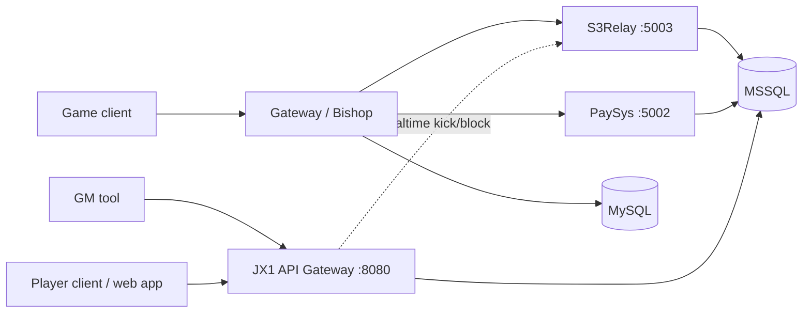

# VLTK Pay Runtime

This repository contains the reconstructed runtime for two proprietary VLTK
services:

- `sword3paysys_cpp`: the C++ PaySys replacement for the Linux service.
- `s3relayserver_cpp`: the C++ S3Relay replacement used by the default runtime.

The implementations preserve the observed Heaven protocol, encrypted framing,
response layouts, connection state, and database postconditions. Authentication
is enforced by the configured backend and protocol flow; this is not a
password-bypass implementation.

## Architecture

```text
Client ──► Gateway/Bishop ──► C++ PaySys :5002
                       └──► C++ S3Relay :5003 ──► MSSQL
Gateway ──► MySQL :3306
GameServer/Goddess/Bishop remain part of the existing Gateway runtime.
```



The public runtime combines the native PaySys/Relay replacements with the
optional JX1 API Gateway submodule. The gateway serves both GM administration
endpoints and player-facing account/authentication endpoints; both flows use
MSSQL, while only GM mutation flows may call Heaven/S3Relay realtime actions.

The default Compose topology includes MySQL, MSSQL, C++ PaySys, C++ S3Relay,
and Gateway. The Windows/Wine Relay reference service is profile-gated and is
used for differential comparison only.

## Implemented protocol surface

- `0x21` (`kOpcodeAccountLogin`): account credential exchange and account/IP operations.
- `0x22`: game-login forwarding or local consumption.
- `0x23`: logout and session cleanup.
- `0x24`: Gateway/Relay verification.
- `0x26` (`kOpcodeGatewayInfo`): native gateway-info and route/address queries.
- `0x70` / `0x82`: heartbeat request and response.

The numeric opcode values and wire layouts remain unchanged; descriptive names
are source-level constants only. Native runtime persistence uses MSSQL for the
PaySys and Relay services. CSV files under `captures/` are historical evidence,
not runtime data sources.

## Safety and reliability

- Strict peer, server, credential, port, and frame validation.
- Atomic MSSQL account/session mutations with rollback on failure.
- Duplicate-route ownership protection and controlled reconnect handoff.
- Business-level healthchecks and bounded malformed-frame fuzzing.

## Testing

The repository includes differential, protocol, transaction, cold-boot, and
fuzz harnesses. See [GUIDE.md](GUIDE.md) for commands and operational details.

## Scope and limitations

The C++ services cover the captured PaySys and S3Relay branches, including
verification, login, heartbeat, logout, routing, database failure handling,
malformed frames, duplicate sessions, and concurrency. This is not a claim of
perfect equivalence for binary branches that were never captured.

Gateway gameplay executables (Goddess, Bishop, and GameServer) remain part of
the existing runtime; this repository replaces PaySys and S3Relay only.

## Related documentation

- [GUIDE.md](GUIDE.md): build, configuration, startup, healthchecks, testing, and troubleshooting.
- [docs/OPERATIONS.md](docs/OPERATIONS.md): operations, rollback, and fixtures.
